# NATS Control UI

A modern, responsive web interface for managing NATS control plane with multi-cluster support. This is the frontend application for the NATS Control API, providing comprehensive management capabilities for NATS clusters, accounts, users, and JetStream configurations in a distributed cloud environment.

Built with Vue 3, TypeScript, and Element Plus for a professional, intuitive user experience.

English | [简体中文](README_ZH.md)

## Features

### 🌐 Cluster Management
- Create, edit, and manage NATS clusters with comprehensive configuration
- Real-time cluster health monitoring and status tracking
- Multi-cluster JWT synchronization and coordination
- Cluster topology visualization and monitoring dashboard
- Test cluster connections and validate configurations

### 🏢 Account Management
- Create, edit, and manage NATS accounts with detailed permissions
- Configure account limits, quotas, and resource restrictions
- Advanced JetStream configuration and stream management
- Import/Export settings for inter-account communication
- Account status management (enable/disable) with bulk operations

### 👥 User Management
- Create and manage users within accounts with role-based access
- Detailed permission configuration with granular controls
- Advanced access control settings (IP restrictions, time limits, connection types)
- User credential management and JWT generation
- User status management with audit trails

### 📊 JetStream Management
- Create and configure JetStream streams and consumers
- Monitor stream performance and consumer health
- Configure retention policies and storage settings
- Stream replication across clusters
- Advanced stream analytics and metrics
- 🆕 **Retry Failed Creations**: Automatic retry capability for failed JetStream creations with persistent configuration storage

### 📋 JWT Task Monitoring
- Real-time JWT synchronization task monitoring with live updates
- Task retry functionality with intelligent retry policies
- Detailed error reporting and troubleshooting information
- Task timeline and comprehensive status tracking
- Performance statistics dashboard with historical data

### 🎨 Modern UI Features
- Dark/Light theme support with system preference detection
- Fully responsive design optimized for all devices and screen sizes
- Real-time data updates with WebSocket integration
- Intuitive navigation with breadcrumbs and search functionality
- Advanced filtering, sorting, and pagination
- Copy-to-clipboard functionality for easy credential sharing
- Keyboard shortcuts for power users
- Accessibility compliance (WCAG 2.1)

## Architecture

### Frontend Stack
- **Vue 3** - Progressive JavaScript framework with Composition API
- **TypeScript** - Type-safe development with full IDE support
- **Element Plus** - Professional Vue 3 component library
- **Pinia** - Modern state management for Vue
- **Vue Router** - Official client-side routing solution
- **Axios** - Promise-based HTTP client with interceptors
- **Vite** - Next-generation build tool and dev server
- **SCSS** - Advanced CSS preprocessing
- **ESLint + Prettier** - Code quality and formatting

### Backend Integration
- RESTful API integration with the NATS Control API backend
- Comprehensive error handling and user feedback
- JWT authentication support (when implemented)
- Real-time data synchronization
- Optimistic UI updates for better user experience
- Request/response logging and debugging support

## Quick Start

### Prerequisites
- **Node.js** 18.1+ (Note: v18.0.0 has compatibility issues with vue-tsc)
- **npm/yarn/pnpm** package manager
- **Running Backend**: NATS Control API backend (see `nats-control-api` project)
- **Browser**: Modern web browser with ES2020+ support (Chrome 90+, Firefox 88+, Safari 14+, Edge 90+)

### Installation

1. Navigate to the UI directory:
```bash
cd nats-control-ui
```

2. Install dependencies:
```bash
npm install
# or
yarn install
# or
pnpm install
```

3. Configure environment (optional):
```bash
# The app will use default settings if no .env file is present
# Default API URL: http://localhost:8080
cp .env.example .env
# Edit .env with your API endpoint if different
```

### Development

**Start development server:**
```bash
npm run dev
# or
yarn dev
# or
pnpm dev

# The dev server will start on http://localhost:5173 by default
# You can specify a custom port:
npm run dev -- --port 3000
```

Then open your browser to the URL shown in the terminal (default: `http://localhost:5173`)

### Production Build

**Build for production:**
```bash
# Full build with type checking
npm run build

# If you encounter vue-tsc issues (Node.js v18.0.0), use:
npx vite build

# or with other package managers:
yarn build
pnpm build
```

The built files will be in the `dist/` directory, ready for deployment.

**Preview production build locally:**
```bash
npm run preview
# or
yarn preview
# or
pnpm preview

# The preview server will start on http://localhost:4173 by default
```

### Available Scripts

- `npm run dev` - Start development server with hot-reload
- `npm run build` - Build for production (includes TypeScript type checking)
- `npm run preview` - Preview production build locally
- `npm run lint` - Lint and auto-fix code issues
- `npm run format` - Format code with Prettier
- `npx vite build` - Build for production (skip type checking if needed)

## Configuration

### Environment Variables

Create a `.env` file in the root directory (optional):

```env
# API Configuration
VITE_API_BASE_URL=http://localhost:8080
VITE_API_TIMEOUT=30000

# Application Configuration
VITE_APP_TITLE=NATS Control Management
VITE_APP_VERSION=1.0.0

# Development Configuration
VITE_DEV_MOCK_API=false
VITE_DEV_AUTO_LOGIN=false
```

### Proxy Configuration

The development server is configured to proxy API requests to the backend:

```typescript
// vite.config.ts
server: {
  proxy: {
    '/api': {
      target: 'http://localhost:8080',
      changeOrigin: true,
    },
  },
}
```

## Project Structure

```
src/
├── api/                    # API client modules
│   ├── client.ts          # Axios configuration and interceptors
│   ├── accounts.ts        # Account API calls
│   ├── users.ts           # User API calls
│   ├── clusters.ts        # Cluster API calls
│   ├── jetstreams.ts      # JetStream API calls
│   └── jwt-tasks.ts       # JWT task API calls
├── components/            # Reusable Vue components
│   └── ClusterTopologyChart.vue  # Cluster visualization
├── layouts/               # Layout components
│   └── Layout.vue         # Main application layout
├── router/                # Vue Router configuration
│   └── index.ts          # Route definitions
├── stores/                # Pinia state management
│   ├── accounts.ts        # Account store
│   ├── users.ts           # User store
│   ├── clusters.ts        # Cluster store
│   ├── jetstreams.ts      # JetStream store
│   └── theme.ts           # Theme store
├── styles/                # Global styles and themes
│   └── index.scss        # Main stylesheet
├── types/                 # TypeScript type definitions
│   └── index.ts          # Shared type definitions
├── utils/                 # Utility functions
│   └── index.ts          # Common utilities
├── views/                 # Page components
│   ├── Dashboard.vue      # Main dashboard
│   ├── accounts/          # Account management pages
│   ├── users/             # User management pages
│   ├── clusters/          # Cluster management pages
│   ├── jetstreams/        # JetStream management pages
│   └── jwt-tasks/         # JWT task management pages
└── main.ts                # Application entry point
```

## API Integration

### Cluster Management
- `GET /api/v1/clusters` - List clusters
- `POST /api/v1/clusters` - Create cluster
- `GET /api/v1/clusters/:id` - Get cluster details
- `PUT /api/v1/clusters/:id` - Update cluster
- `DELETE /api/v1/clusters/:id` - Delete cluster
- `GET /api/v1/clusters/:id/status` - Get cluster status

### Account Management
- `GET /api/v1/accounts` - List accounts
- `POST /api/v1/accounts` - Create account
- `GET /api/v1/accounts/:id` - Get account details
- `PUT /api/v1/accounts/:id` - Update account
- `POST /api/v1/accounts/:id/enable` - Enable account
- `POST /api/v1/accounts/:id/disable` - Disable account

### User Management
- `GET /api/v1/users` - List users
- `GET /api/v1/accounts/:id/users` - List account users
- `POST /api/v1/accounts/:accountId/users` - Create user
- `GET /api/v1/users/:id` - Get user details
- `PUT /api/v1/users/:id` - Update user
- `POST /api/v1/users/:id/enable` - Enable user
- `POST /api/v1/users/:id/disable` - Disable user

### JetStream Management
- `GET /api/v1/jetstreams` - List JetStreams
- `POST /api/v1/jetstreams` - Create JetStream
- `GET /api/v1/jetstreams/:id` - Get JetStream details
- `PUT /api/v1/jetstreams/:id` - Update JetStream
- `DELETE /api/v1/jetstreams/:id` - Delete JetStream
- `POST /api/v1/jetstreams/:id/sync` - Sync JetStream status
- 🆕 `POST /api/v1/jetstreams/:id/retry` - Retry failed JetStream creation

### JWT Task Management
- `GET /api/v1/jwt-tasks` - List JWT tasks
- `GET /api/v1/jwt-tasks/:id` - Get task details
- `POST /api/v1/jwt-tasks/:id/retry` - Retry failed task
- `GET /api/v1/jwt-tasks/stats` - Get task statistics

## Key Features Explained

### Cluster Configuration
- **Basic Information**: Name, description, endpoint URLs, authentication settings
- **Connection Management**: Test connections, validate configurations, monitor health
- **Multi-cluster Sync**: Coordinate JWT synchronization across multiple clusters
- **Performance Monitoring**: Real-time metrics and cluster topology visualization

### Account Configuration
- **Basic Information**: Name, description, status, creation metadata
- **Account Limits**: Connection limits, data transfer quotas, message rate limits
- **JetStream**: Persistent messaging configuration, stream limits, storage quotas
- **Import/Export**: Account-level service/stream sharing and permissions
- **Default Permissions**: Account-wide permission templates and inheritance

### User Permissions
- **Publish Permissions**: Subject-based publish control with wildcards and deny rules
- **Subscribe Permissions**: Subject-based subscription control with queue groups
- **Response Permissions**: Request-response pattern control and timeout settings
- **JetStream Permissions**: Stream-specific permissions and consumer limits
- **Access Controls**: IP restrictions, time-based access, connection type limits

### JetStream Configuration
- **Stream Settings**: Retention policies, storage type, replication factor
- **Consumer Management**: Delivery policies, acknowledgment settings, replay options
- **Performance Tuning**: Memory and file storage limits, duplicate detection
- **Cross-cluster Replication**: Stream mirroring and sourcing configuration
- 🆕 **Failure Recovery**: Retry failed creations with preserved configurations and intelligent error handling

### JWT Task System
- **Automatic Synchronization**: Real-time JWT updates across all configured clusters
- **Error Handling**: Comprehensive error categorization and resolution guidance
- **Retry Logic**: Intelligent retry policies with exponential backoff
- **Status Tracking**: Complete task lifecycle monitoring with detailed timestamps
- **Performance Analytics**: Task execution metrics and cluster synchronization health

## Development

### Code Style
- ESLint for code linting with TypeScript rules
- Prettier for consistent code formatting
- TypeScript strict mode with comprehensive type checking
- Vue 3 Composition API with `<script setup>` syntax
- Consistent naming conventions (camelCase for JS, kebab-case for CSS)

### Development Guidelines
- Use TypeScript for all components and modules
- Follow Vue 3 composition API patterns and best practices
- Implement comprehensive error handling with user-friendly messages
- Use Element Plus components consistently for UI consistency
- Write unit tests for critical business logic
- Document complex components and utilities

### State Management
- Pinia stores for complex application state
- Local reactive state for component-specific data
- Centralized API error handling and user notifications
- Optimistic updates with rollback on failure
- State persistence for user preferences

## Deployment

### Docker Deployment

```dockerfile
# Multi-stage build for optimized production image
FROM node:18-alpine AS builder

WORKDIR /app
COPY package*.json ./
RUN npm ci --only=production

COPY . .
RUN npm run build

FROM nginx:alpine
COPY --from=builder /app/dist /usr/share/nginx/html
COPY nginx.conf /etc/nginx/conf.d/default.conf

EXPOSE 80
CMD ["nginx", "-g", "daemon off;"]
```

### Nginx Configuration

```nginx
server {
    listen 80;
    server_name localhost;
    root /usr/share/nginx/html;
    index index.html;

    # Enable gzip compression
    gzip on;
    gzip_types text/plain text/css application/json application/javascript text/xml application/xml;

    # Handle client-side routing
    location / {
        try_files $uri $uri/ /index.html;
    }
    
    # Proxy API requests to backend
    location /api {
        proxy_pass http://nats-control-api:8080;
        proxy_set_header Host $host;
        proxy_set_header X-Real-IP $remote_addr;
        proxy_set_header X-Forwarded-For $proxy_add_x_forwarded_for;
        proxy_set_header X-Forwarded-Proto $scheme;
    }

    # Cache static assets
    location ~* \.(js|css|png|jpg|jpeg|gif|ico|svg)$ {
        expires 1y;
        add_header Cache-Control "public, immutable";
    }
}
```

## Contributing

We welcome contributions from the community! Please follow these guidelines:

### How to Contribute

1. **Fork the repository** to your GitHub account
2. **Clone your fork** locally:
   ```bash
   git clone https://github.com/YOUR_USERNAME/nats-control-ui.git
   cd nats-control-ui
   ```
3. **Create a feature branch** with a descriptive name:
   ```bash
   git checkout -b feature/amazing-feature
   # or
   git checkout -b fix/bug-description
   ```
4. **Make your changes** following the code style guidelines
5. **Test your changes** thoroughly:
   ```bash
   npm run lint
   npm run format
   npm run build
   ```
6. **Commit your changes** with clear, descriptive messages:
   ```bash
   git commit -m 'feat: add amazing feature'
   # or
   git commit -m 'fix: resolve issue with user authentication'
   ```
7. **Push to your fork**:
   ```bash
   git push origin feature/amazing-feature
   ```
8. **Open a Pull Request** with:
   - Clear title and description
   - Reference to any related issues
   - Screenshots (if UI changes)
   - Test results

### Development Setup
1. Ensure the backend API is running (see `nats-control-api` project)
2. Follow the installation instructions above
3. Make your changes and test thoroughly
4. Run linting and formatting: `npm run lint && npm run format`
5. Ensure all TypeScript types are correct: `npm run build`

### Code Style Guidelines
- Follow existing code patterns and conventions
- Use TypeScript for all new code
- Add comments for complex logic
- Write clear, descriptive variable and function names
- Keep components small and focused
- Ensure accessibility (ARIA labels, keyboard navigation)

### Commit Message Convention
We follow the [Conventional Commits](https://www.conventionalcommits.org/) specification:
- `feat:` - New feature
- `fix:` - Bug fix
- `docs:` - Documentation changes
- `style:` - Code style changes (formatting, etc.)
- `refactor:` - Code refactoring
- `test:` - Adding or updating tests
- `chore:` - Maintenance tasks

## License

This project is licensed under the MIT License - see the [LICENSE](LICENSE) file for details.

Copyright (c) 2025 nats-control-ui

Permission is hereby granted, free of charge, to any person obtaining a copy of this software and associated documentation files (the "Software"), to deal in the Software without restriction, including without limitation the rights to use, copy, modify, merge, publish, distribute, sublicense, and/or sell copies of the Software, and to permit persons to whom the Software is furnished to do so, subject to the following conditions:

The above copyright notice and this permission notice shall be included in all copies or substantial portions of the Software.

## Support

For support and questions:
- Create an issue in the repository
- Check the API documentation at `http://localhost:8080/swagger/index.html`
- Review the troubleshooting guide below

## Troubleshooting

### Common Issues

1. **API Connection Failed**
   - Ensure the NATS Control API backend is running on `http://localhost:8080`
   - Check network connectivity between frontend and backend
   - Verify CORS configuration in the backend
   - Check browser console for detailed error messages

2. **Build Errors**
   - Clear `node_modules` and reinstall: `rm -rf node_modules package-lock.json && npm install`
   - Check Node.js version compatibility (requires 18+)
   - Verify TypeScript configuration and fix any type errors
   - Ensure all dependencies are compatible

3. **Theme/UI Issues**
   - Clear browser cache and local storage
   - Check CSS custom properties support in your browser
   - Verify Element Plus theme configuration
   - Test in different browsers for compatibility

4. **Development Server Issues**
   - Check if port 5173 is available
   - Try running with different port: `npm run dev -- --port 3000`
   - Verify Vite configuration and proxy settings
   - Check for conflicting browser extensions

5. **Docker Deployment Issues**
   - Ensure Docker and Docker Compose are installed and running
   - Check that the backend service is accessible from the container
   - Verify nginx configuration and proxy settings
   - Check container logs: `docker logs <container-name>`

## Screenshots

### Dashboard Overview
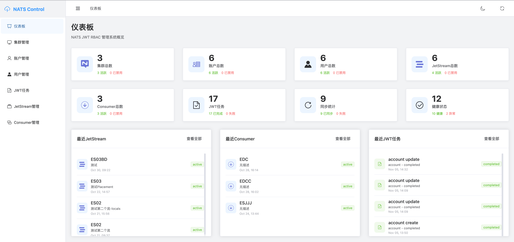

### Cluster Management
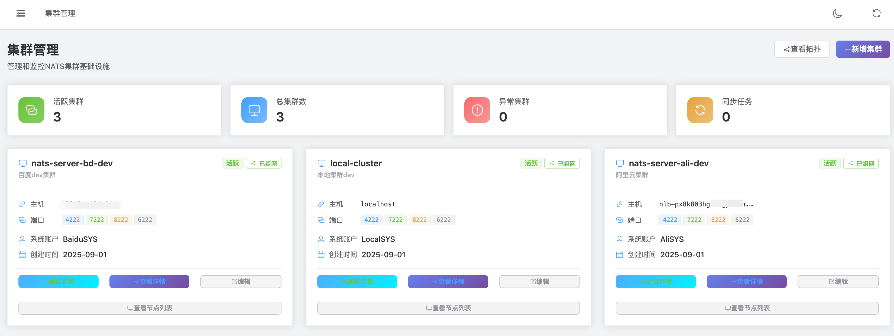
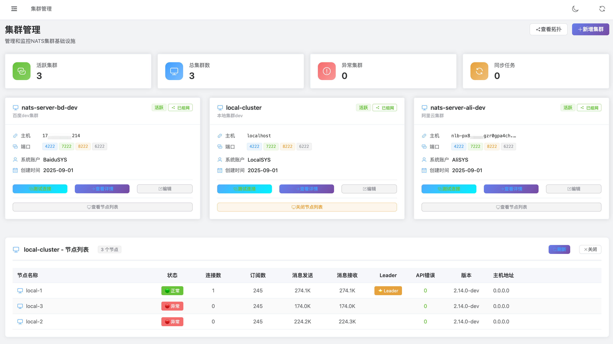
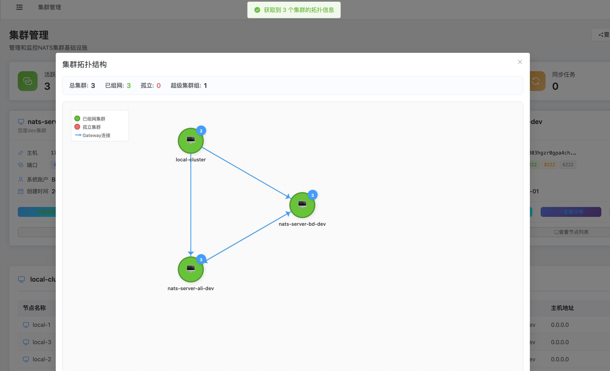
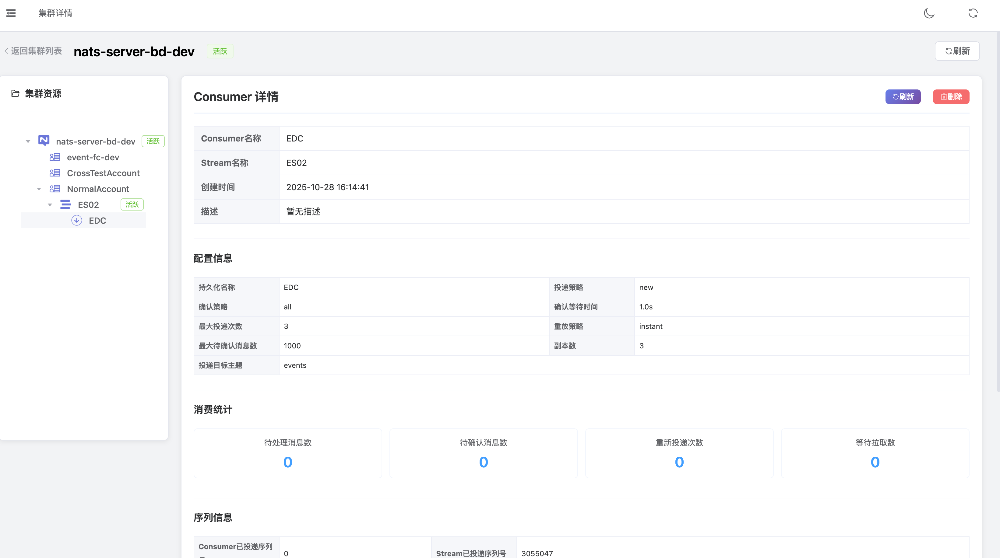

### Account Management
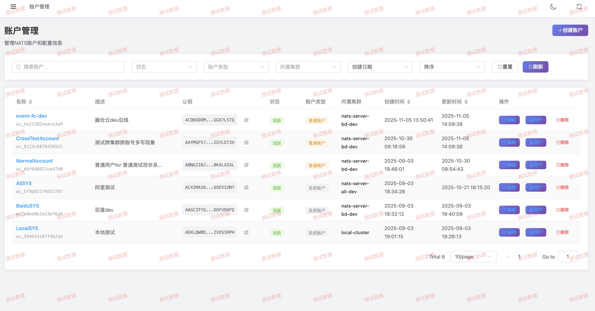
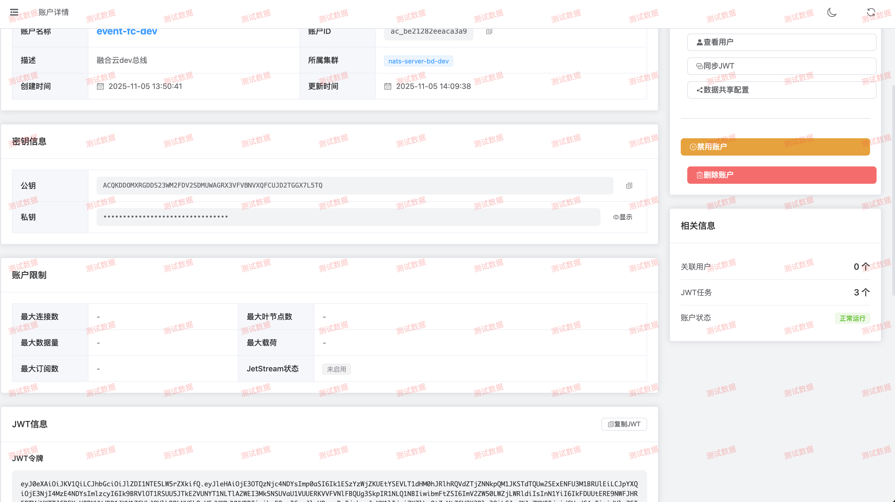

### User Management
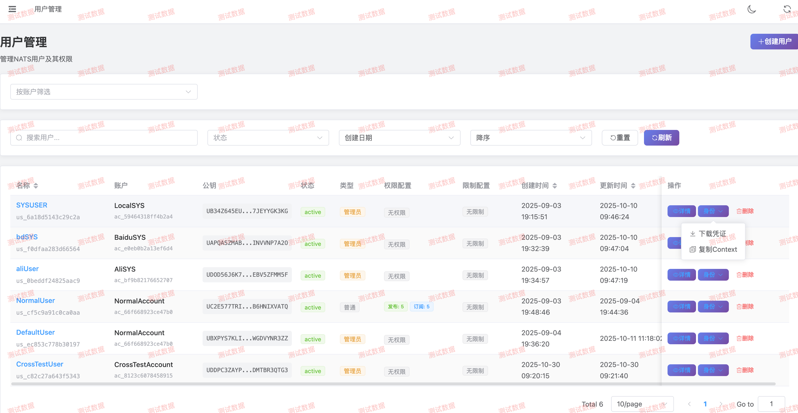
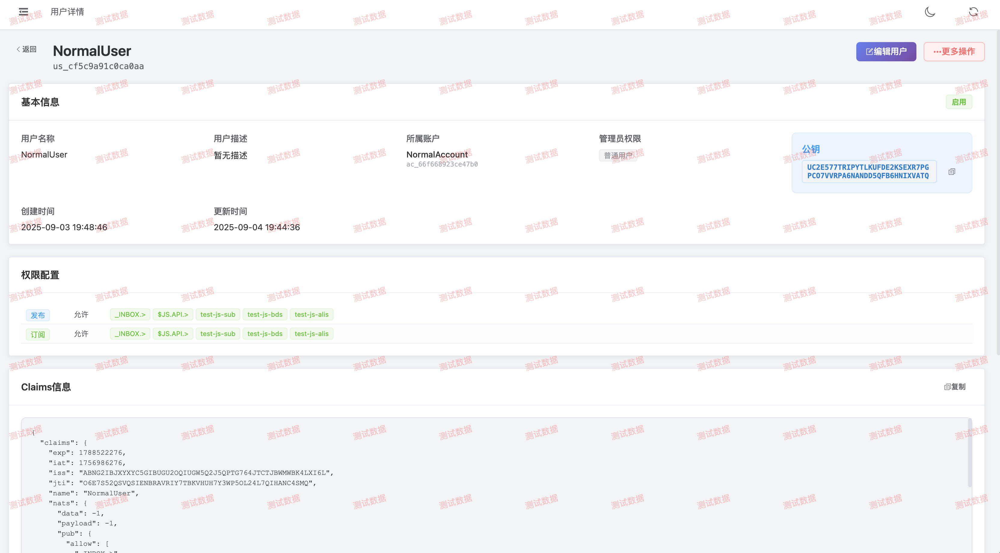

### JetStream Management
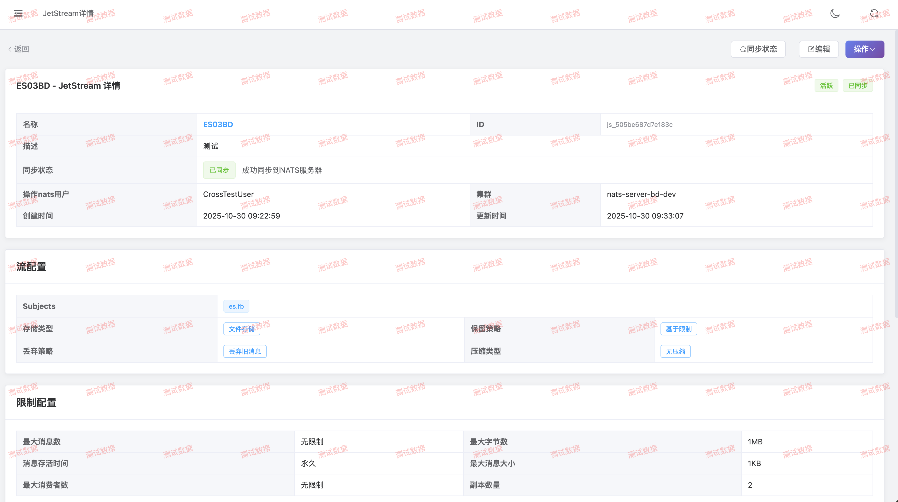
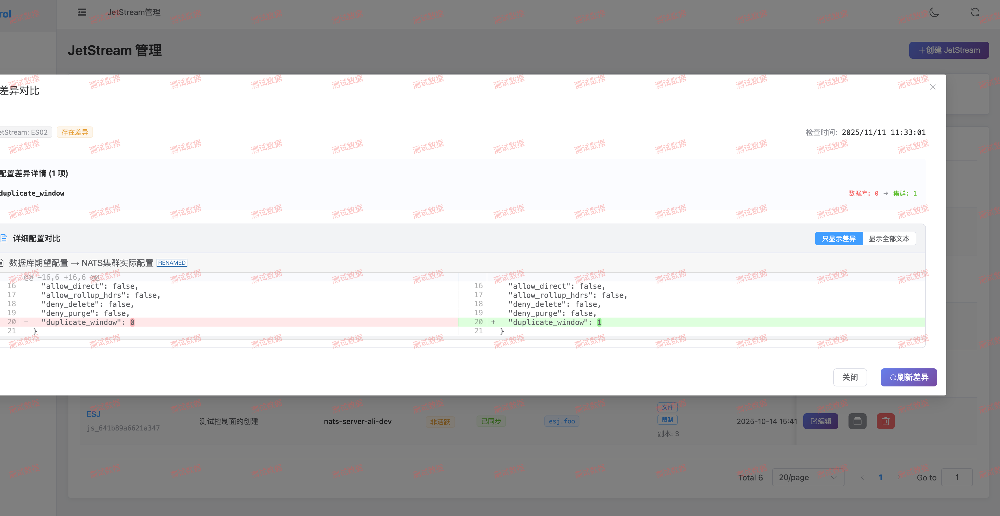

### Consumer Management
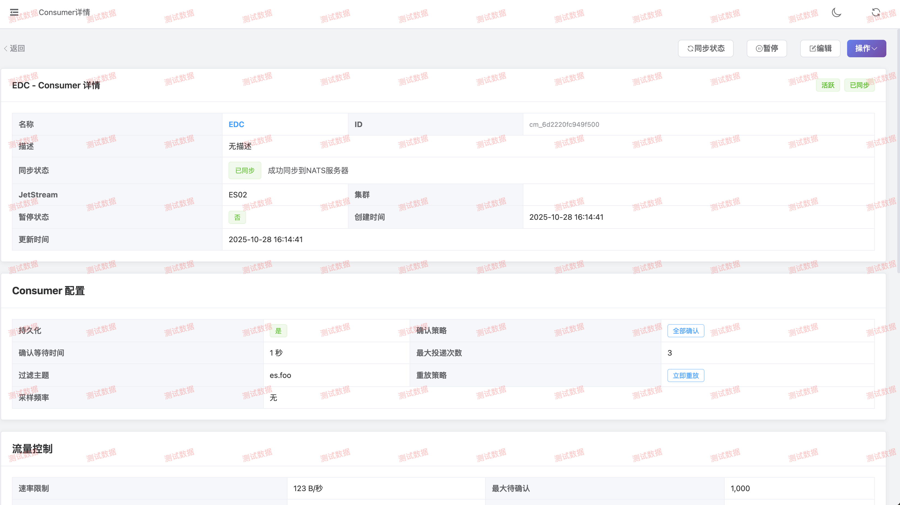
